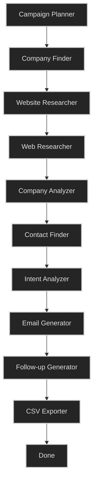

# SignalFlow AI

🚀 **SignalFlow AI** is an AI-powered Go-To-Market (GTM) Campaign Builder that automates the entire outbound prospecting and personalization funnel. Utilizing an asynchronous **LangGraph** agentic workflow, SignalFlow AI searches for companies matching an ICP, conducts real-time web research, extracts decision-maker contacts, scores prospect intent, drafts multi-step personalized cold email sequences, and exports launch-ready outbound campaigns.

---

## 🏗️ Architecture & Agentic Workflow

SignalFlow AI models its GTM research process as a state machine using **LangGraph**. The workflow runs asynchronously in a background thread, updating the campaign state dynamically.



### LangGraph Nodes Explained

1. **Campaign Planner (`campaign_planner`)**: Parses input criteria and initializes the campaign workflow state.
2. **Company Finder (`company_finder`)**: Leverages **People Data Labs (PDL)** to locate target companies matching industry, location, and headcount parameters.
3. **Website Researcher (`website_researcher`)**: Uses **Firecrawl** to scrape prospect homepages, extracting core offerings, positioning, and context.
4. **Web Researcher (`web_researcher`)**: Performs web queries via **Tavily** to find live signals (recent funding, open job listings, or news).
5. **Company Analyzer (`company_analyzer`)**: Employs Claude-3-Haiku (via OpenRouter) to identify company pain points, value propositions, and optimal angles of approach.
6. **Contact Finder (`contact_finder`)**: Searches for key decision-makers matching personas via **People Data Labs**. If no contacts are found, it falls back to parsing team page directories scraped via **Firecrawl**.
7. **Intent Analyzer (`intent_analyzer`)**: Scores the alignment of the company and target prospects on a scale of `0-100` and generates reasoning for the score.
8. **Email Generator (`email_generator`)**: Generates an initial personalized cold email using context gathered from the research steps.
9. **Follow-up Generator (`followup_generator`)**: Drafts a sequence of follow-ups (Follow-up 1, Follow-up 2, and a break-up email).
10. **CSV Exporter (`csv_exporter`)**: Compiles and exports structured output data into a CSV format compatible with major sales sequencers.

---

## 🛠️ Tech Stack

### Frontend
- **Framework**: Next.js 16.2 (App Router)
- **Language**: TypeScript
- **Styling**: Tailwind CSS v4, PostCSS, `@base-ui/react`
- **UI Components**: Shadcn UI, Radix UI primitive components
- **State Management**: TanStack Query v5 (Server State), Zustand (Client/UI State)
- **HTTP Client**: Axios

### Backend
- **Framework**: FastAPI (Python 3.11+)
- **Async Execution**: Python threading / BackgroundTasks
- **Agent Orchestration**: LangGraph, LangChain
- **Database ORM**: SQLAlchemy 2.0, Alembic (migrations)
- **Data Manipulation**: Pandas
- **LLM Provider**: OpenRouter (`anthropic/claude-3-haiku` / optional models)

### Integrated APIs
- **People Data Labs**: Company search and B2B contact enrichment.
- **Firecrawl**: Single-page and subpage scraping (markdown conversion).
- **Tavily Search**: OSINT queries, funding research, and email pattern discovery.

---

## 📁 Repository Layout

```
NEW_GTM/
├── backend/
│   ├── main.py                 # FastAPI server entry point
│   ├── requirements.txt        # Python backend dependencies
│   ├── .env.example            # Environment variables blueprint
│   └── app/
│       ├── config.py           # Application settings and Pydantic configuration
│       ├── db.py               # Database engine, session maker, and Base model
│       ├── models.py           # SQLAlchemy ORM models (Campaign, Company, Contact, Email)
│       ├── schemas.py          # Pydantic schemas for request/response validation
│       ├── routers/            # FastAPI API endpoints
│       │   ├── campaigns.py    # Campaign CRUD & launch workflow
│       │   ├── companies.py    # Company retrieval & analysis
│       │   ├── emails.py       # Email sequence viewing/regeneration
│       │   └── exports.py      # CSV export endpoints
│       ├── services/           # Clients for external integrations
│       │   ├── people_data_labs.py # PDL company/contact search
│       │   ├── firecrawl.py    # HTML-to-Markdown scraper
│       │   ├── tavily.py       # Search API & OSINT client
│       │   ├── contacts.py     # Fallback contact scraping & domain analysis
│       │   └── llm.py          # OpenAI/OpenRouter interface
│       └── graph/              # LangGraph agent configuration
│           ├── state.py        # Shared agent state definition (WorkflowState)
│           ├── nodes.py        # Implementations of individual pipeline nodes
│           └── workflow.py     # LangGraph compilation & edges
│
└── frontend/
    ├── package.json            # Node.js dependencies
    ├── src/
    │   ├── app/                # Next.js pages & layouts
    │   │   ├── dashboard/      # Analytics overview
    │   │   ├── campaigns/      # Campaign monitoring and creation
    │   │   ├── companies/      # Detailed target company view
    │   │   ├── emails/         # Personalization & sequence editor
    │   │   └── exports/        # Download CSV lists
    │   ├── components/         # Reusable React components & UI blocks
    │   ├── lib/                # Shared utilities & Axios client
    │   ├── store/              # Zustand global UI states
    │   └── types/              # TypeScript typings
```

---

## ⚡ Setup & Installation

### Prerequisites
- **Python 3.11+** installed.
- **Node.js 20+** installed.
- A running **PostgreSQL** instance.

### 1. Backend Setup
1. Navigate to the backend directory:
   ```bash
   cd backend
   ```
2. Create and activate a Python virtual environment:
   ```bash
   python -m venv venv
   source venv/bin/activate  # On Windows, use: venv\Scripts\activate
   ```
3. Install the dependencies:
   ```bash
   pip install -r requirements.txt
   ```
4. Configure environment variables:
   ```bash
   cp .env.example .env
   ```
   Open the newly created `.env` file and insert your API credentials:
   ```env
   DATABASE_URL=postgresql://<user>:<password>@localhost:5432/signalflow
   OPENROUTER_API_KEY=your-openrouter-key
   PEOPLE_DATA_LABS_API_KEY=your-pdl-key
   FIRECRAWL_API_KEY=your-firecrawl-key
   TAVILY_API_KEY=your-tavily-key
   ```
5. Start the FastAPI backend server:
   ```bash
   uvicorn main:app --reload --port 8000
   ```
   *Note: Database tables are initialized automatically on startup.*

### 2. Frontend Setup
1. Navigate to the frontend directory:
   ```bash
   cd ../frontend
   ```
2. Install Node.js packages:
   ```bash
   npm install
   ```
3. Run the Next.js development server:
   ```bash
   npm run dev
   ```
4. Access the web interface at [http://localhost:3000](http://localhost:3000).

---

## 📝 API Reference

### Campaigns
- `GET /api/campaigns/dashboard` - Get high-level stats (Total leads, average intent score, campaign lists).
- `POST /api/campaigns/` - Create a new campaign and start the asynchronous agent background task.
- `GET /api/campaigns/{id}` - Get execution progress, status, and ICP metrics.
- `DELETE /api/campaigns/{id}` - Delete campaign and associated records.

### Companies & Contacts
- `GET /api/companies/?campaign_id={id}` - Fetch companies discovered for a campaign.
- `GET /api/companies/{id}` - Retrieve details of a company, including extracted signals, analysis, and contact records.

### Emails
- `GET /api/emails/?campaign_id={id}` - Fetch generated emails for a campaign.
- `PUT /api/emails/{id}` - Edit generated email content.
- `POST /api/emails/{id}/regenerate` - Re-trigger LLM email generation with optional prompt guidance.

### Exports
- `GET /api/exports/campaign/{id}` - Stream download of the generated CSV file.

---

## 📄 CSV Export Schema

The campaign export outputs a clean, ready-to-import CSV compatible with sequencers like **Smartlead**, **Instantly.ai**, and **Apollo**:

| Column Name | Description |
|---|---|
| `Company` | Legal name of target organization |
| `Website` | Corporate website URL |
| `Contact Name` | Decision-maker full name |
| `Title` | Job title of the prospect |
| `Email` | B2B email address |
| `LinkedIn` | Prospect LinkedIn profile URL |
| `Intent Score` | Qualification score from `0` to `100` |
| `Intent Reason` | AI reasoning behind the intent score |
| `Subject` | Personalized email subject line |
| `Cold Email` | Personalized introductory email |
| `Follow-up 1` | Day 3 follow-up email |
| `Follow-up 2` | Day 7 follow-up email |
| `Break-up Email` | Final touch email |
